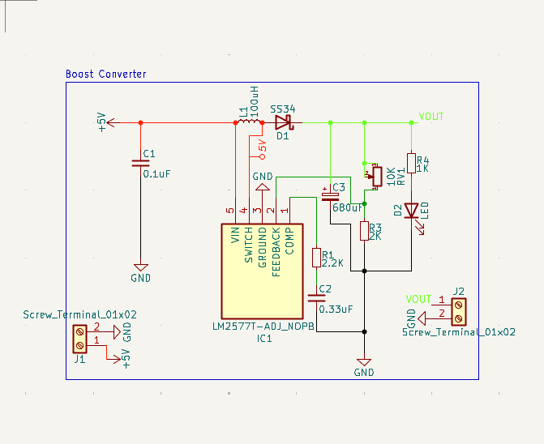
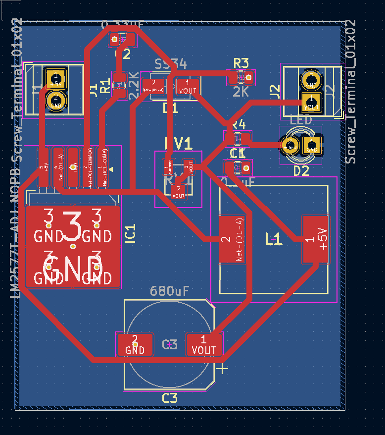

# Barunastra-PCB-Boost-Converter

This is an adjustable boost converter based on the LM2577 IC that can handle upto 2A

It features an adjustable output voltage, a output smoothing capacitor, and a LED indicator

It uses two screw terminals for input and output

The PCB is two layers and a track width of 0.7 mm to handle 2 Amps
